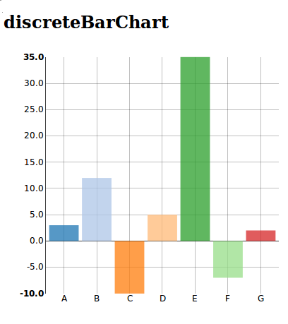

.. _discreteBarChart-model:

:class:`discreteBarChart`
-------------------------

A discrete bar chart or bar graph is a chart with rectangular bars with lengths proportional to the values that they represent.

python-example ::

        from nvd3 import discreteBarChart
        chart = discreteBarChart(name='discreteBarChart', height=400, width=400)
        xdata = ["A", "B", "C", "D", "E"]
        ydata = [3, 4, 0, -3, 5, 7]
        chart.add_serie(y=ydata, x=xdata)
        chart.buildhtml()

js example::

        data = [{ key: "Cumulative Return",
                  values: [
                    {
                      "label": "A",
                      "value" : 10
                    },
                    {
                      "label": "B",
                      "value" : 0
                    },
                    {
                      "label": "C",
                      "value" : -3
                    },
                  ]
                }]

        nv.addGraph(function() {
            var chart = nv.models.discreteBarChart()
                .x(function(d) { return d.label })
                .y(function(d) { return d.value })
                .showLabels(true);

            d3.select("#div_id")
                .datum(data)
                .transition()
                .duration(1200)
                .call(chart);

            return chart;
        });

