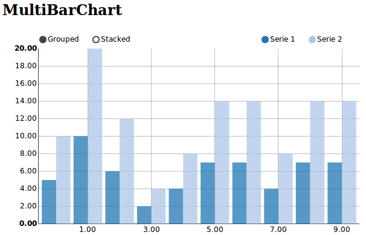

.. _multiBarChart-model:

:class:`multiBarChart`
----------------------

A multiple bar graph contains comparisons of two or more categories or bars. One axis represents a quantity and the other axis identifies a specific feature about the categories. Reading a multiple bar graph includes looking at extremes (tallest/longest vs. shortest) in each grouping.

python-example ::

        from nvd3 import multiBarChart
        chart = multiBarChart(name='multiBarChart', height=400, width=400)
        xdata = [0, 1, 3, 4]
        ydata = [6, 12, 9, 16]
        chart.add_serie(y=ydata, x=xdata)
        chart.buildhtml()

js example::

        data_MultiBarChart = [{ "key" : "Serie 1",
           "values" : [
                { "x" : 0
                  "y" : 6
                },
                { "x" : 1,
                  "y" : 12
                },
                { "x" : 3,
                  "y" : 9
                },
              ],
            "yAxis" : "1"
        }]

        nv.addGraph(function() {
            var chart = nv.models.multiBarChart();
            chart.xAxis
                .tickFormat(d3.format(',.2f'))
            chart.yAxis
                .tickFormat(d3.format(',.2f'))
            d3.select('#MultiBarChart svg')
                .datum(data_MultiBarChart)
                .transition()
                .duration(500)
                .call(chart);
            return chart;
        });

