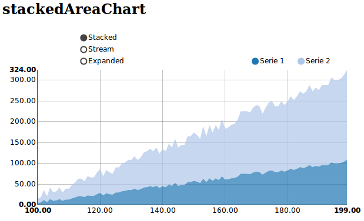

.. _stackedAreaChart-model:

:class:`stackedAreaChart`
-------------------------

The stacked area chart is identical to the area chart, except the areas are stacked on top of each other, rather than overlapping. This can make the chart much easier to read.

python-example ::

        from nvd3 import stackedAreaChart
        chart = stackedAreaChart(name='stackedAreaChart', height=400, width=400)
        xdata = [100, 101, 102, 103, 104, 105, 106,]
        ydata = [6, 11, 12, 7, 11, 10, 11]
        ydata2 = [8, 20, 16, 12, 20, 28, 28]
        chart.add_serie(y=ydata, x=xdata)
        chart.add_serie(y=ydata2, x=xdata)
        chart.buildhtml()

js example::

        data_stackedAreaChart = [{
                  "values":[
                     {
                        "y":9,
                        "x":100
                     },
                     {
                        "y":5,
                        "x":101
                     },
                  ],
                  "key":"Serie 1",
                  "yAxis":"1"
               },
               {
                  "values":[
                     {
                        "y":18,
                        "x":100
                     },
                     {
                        "y":10,
                        "x":101
                     },
                  ],
                  "key":"Serie 2",
                  "yAxis":"1"
               }
            ]

        nv.addGraph(function() {
            var chart = nv.models.stackedAreaChart();
            chart.xAxis
                .tickFormat(d3.format(',.2f'))
            chart.yAxis
                .tickFormat(d3.format(',.2f'))
            d3.select('#stackedAreaChart svg')
                .datum(data_stackedAreaChart)
                .transition()
                .duration(500)
                .call(chart);
            return chart;
        });

